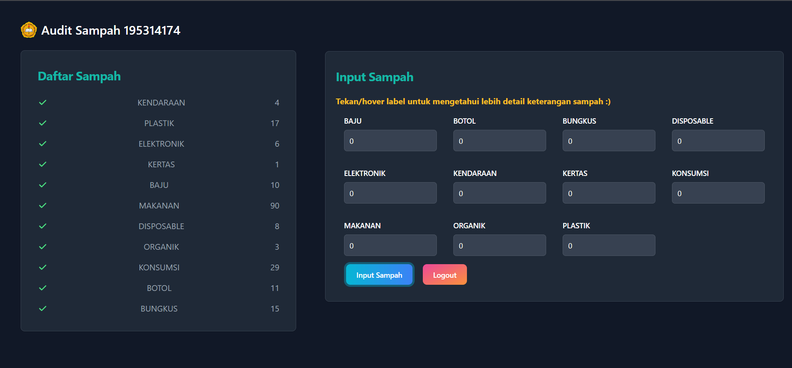

# Audit Sampah USD
Create responsive website for student trash recap in Sanata Dharma University using react.js and tailwindcss

## Table of Content
- About the Project
- Screenshot
- Technologies

## Abut the Project
This website are builded using react js to improve the performance and improve the userr experience for this website. This website also integrated with Firebase Firestore to store the student and trash recap data. In this website, student can login with their Student ID and input the trash recap.

## Screenshot
Here is some example of website sneakpeek, or you can easily access it from  [this link](https://fchsampah.web.app/).
  

## Technologies
- React.js
- Firebase Firestore
- Tailwind CSS
